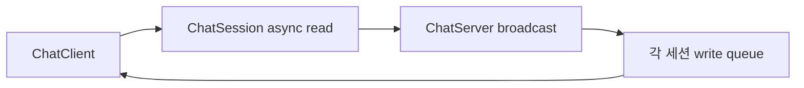

# Boost.Asio Chat

C++17과 Boost.Asio로 만든 최소 비동기 TCP 채팅 예제입니다. 이 솔루션은 채팅의 네트워크 객체 수명과 비동기 버퍼 수명만 설명하며 MUD 게임 코드는 포함하지 않습니다.

## 프로젝트

- `ChatServer`: 포트 7777에서 여러 클라이언트를 받고 메시지를 전체 방송합니다.
- `ChatClient`: `127.0.0.1:7777`에 연결해 콘솔 입력을 보내고 메시지를 비동기로 받습니다.

Visual Studio 2022에서 `BoostAsioChat.sln`을 열고 `Debug | x64` 또는 `Release | x64`로 빌드합니다. 실행 파일은 `x64/<Configuration>/`에 생성됩니다.

## 핵심 수명 규칙

`ChatServer`는 활성 `ChatSession`을 `shared_ptr`로 소유합니다. 각 비동기 콜백도 `shared_from_this()`로 얻은 `self`를 캡처하므로 작업이 끝날 때까지 세션이 살아 있습니다. `ChatSession`에서 서버로 가는 `ChatServer&`는 비소유 참조입니다.

`async_write()`는 문자열을 복사하지 않으므로 `ChatSession::writeQueue_`가 완료 콜백까지 실제 바이트를 소유합니다. 한 번에 쓰기 하나만 실행하고 완료된 뒤에만 큐의 앞 항목을 제거합니다.

## 실행

1. `ChatServer.exe`를 실행합니다.
2. 터미널 두 개에서 `ChatClient.exe`를 실행합니다.
3. 한 클라이언트에서 입력한 문장이 두 클라이언트 모두에 표시되는지 확인합니다.

MUD 예제는 상위 디렉터리의 별도 `BoostAsioMud` 솔루션에 있습니다.
