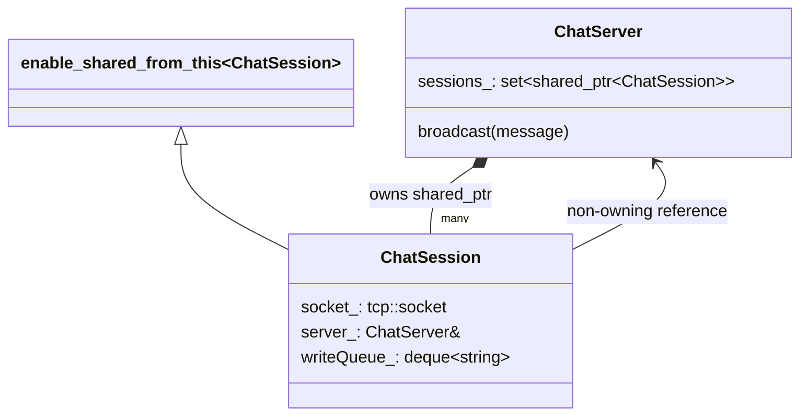
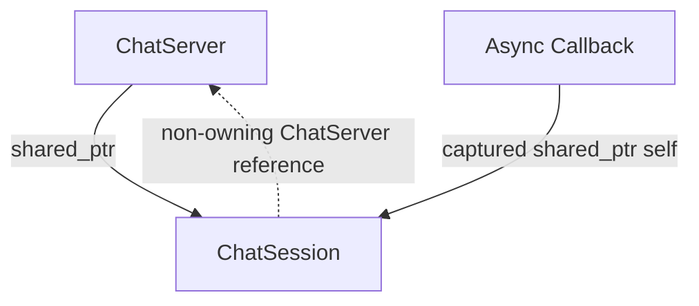
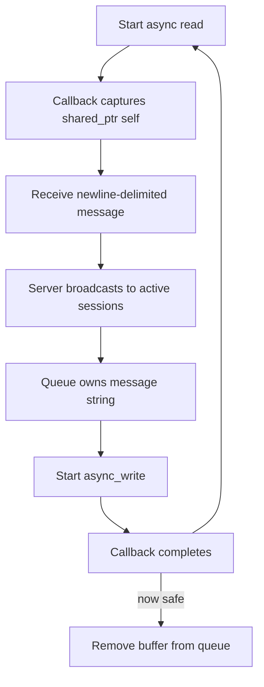

# Boost.Asio Chat

C++17과 Boost.Asio로 만든 교육용 TCP 채팅 예제입니다. 기능보다 **비동기 작업 중 객체와 버퍼를 누가 살려 두는가**를 보여 주는 데 초점을 둡니다.

## 구성

```text
BoostAsioChat/
├─ BoostAsioChat.sln
├─ ChatServer/
│  ├─ ChatServer.vcxproj
│  ├─ main.cpp
│  ├─ ChatServer.h / ChatServer.cpp
│  └─ ChatSession.h / ChatSession.cpp
└─ ChatClient/
   ├─ ChatClient.vcxproj
   ├─ main.cpp
   └─ ChatClient.h / ChatClient.cpp
```

`ChatServer.exe`는 포트 7777에서 여러 클라이언트를 받고, 줄 단위 메시지를 모든 세션에 전송합니다. `ChatClient.exe`는 기본적으로 `127.0.0.1:7777`에 연결합니다.

## Visual Studio 2022에서 빌드

1. vcpkg에서 Boost.Asio를 설치하고 Visual Studio 통합을 활성화합니다(예: `vcpkg install boost-asio:x64-windows`, `vcpkg integrate install`).
2. `BoostAsioChat.sln`을 엽니다.
3. 구성에서 **Debug**, 플랫폼에서 **x64**를 선택합니다.
4. **Build > Build Solution**을 실행합니다.

실행 파일은 `BoostAsioChat/x64/Debug/`에 생성됩니다.

## 실행

### 방법 1: 각각 실행

1. 솔루션을 빌드합니다.
2. 첫 번째 터미널에서 `ChatServer.exe`를 실행합니다.
3. 서로 다른 두 터미널에서 `ChatClient.exe`를 실행합니다.
4. 한 클라이언트에 메시지를 입력하면 두 클라이언트가 모두 메시지를 받습니다.

### 방법 2: 여러 시작 프로젝트

Visual Studio에서 **Solution Properties > Common Properties > Startup Project > Multiple startup projects**로 이동해 `ChatServer`와 `ChatClient`의 Action을 `Start`로 지정합니다. 두 클라이언트 테스트에는 두 번째 `ChatClient.exe`를 별도 터미널에서 한 번 더 실행해야 합니다.

## 클래스 관계



## 비동기 객체 수명과 소유권

`async_read_until()`과 `async_write()`는 작업을 **시작만 하고 즉시 반환**합니다. 실제 완료 콜백은 나중에 `io_context.run()` 안에서 호출되므로, 시작 함수의 지역 변수가 사라져도 작업 대상 객체와 데이터가 살아 있어야 합니다.

람다의 `[this]`는 주소만 복사하며 객체 수명을 연장하지 않습니다. 객체가 먼저 파괴되면 콜백의 `this`는 무효 주소가 됩니다. `ChatSession`이 `enable_shared_from_this<ChatSession>`을 상속하고 콜백마다 `auto self = shared_from_this()`를 캡처하는 이유는 완료될 때까지 같은 소유 제어 블록의 `shared_ptr` 하나를 유지하기 위해서입니다.

`std::shared_ptr<ChatSession>(this)`를 사용하면 안 됩니다. 이미 존재하는 `shared_ptr`과 별개의 제어 블록이 생겨 한 객체를 두 번 삭제할 수 있습니다. 객체는 처음부터 `make_shared`로 만들고, 내부에서는 기존 제어 블록을 공유하는 `shared_from_this()`를 사용합니다.



`ChatServer`는 활성 세션의 `shared_ptr` 집합을 소유합니다. 비동기 콜백도 작업 중에는 `self`를 통해 세션을 공동 소유합니다. 반대로 세션에서 서버로 가는 `ChatServer&`는 비소유 참조이므로 순환 소유가 생기지 않습니다. 서버의 수명은 `main()`의 `io_context.run()` 전체를 감쌉니다.

## 읽기·브로드캐스트·쓰기 흐름



`asio::buffer()`는 문자열을 복사하지 않고 메모리 위치를 가리킬 뿐입니다. 따라서 임시 문자열로 `async_write()`를 시작하면 완료 전에 메모리가 사라질 수 있습니다. 각 `ChatSession`의 `writeQueue_`가 문자열을 소유하고, 쓰기 완료 콜백에서만 맨 앞 문자열을 제거합니다. 동시에 하나의 쓰기만 실행하므로 메시지 순서도 유지됩니다.

핵심 답은 다음과 같습니다. **서버 컬렉션과 콜백의 `shared_ptr`가 세션 객체를 살려 두고, 세션의 쓰기 큐가 전송 버퍼를 완료 시점까지 살려 둡니다.**
