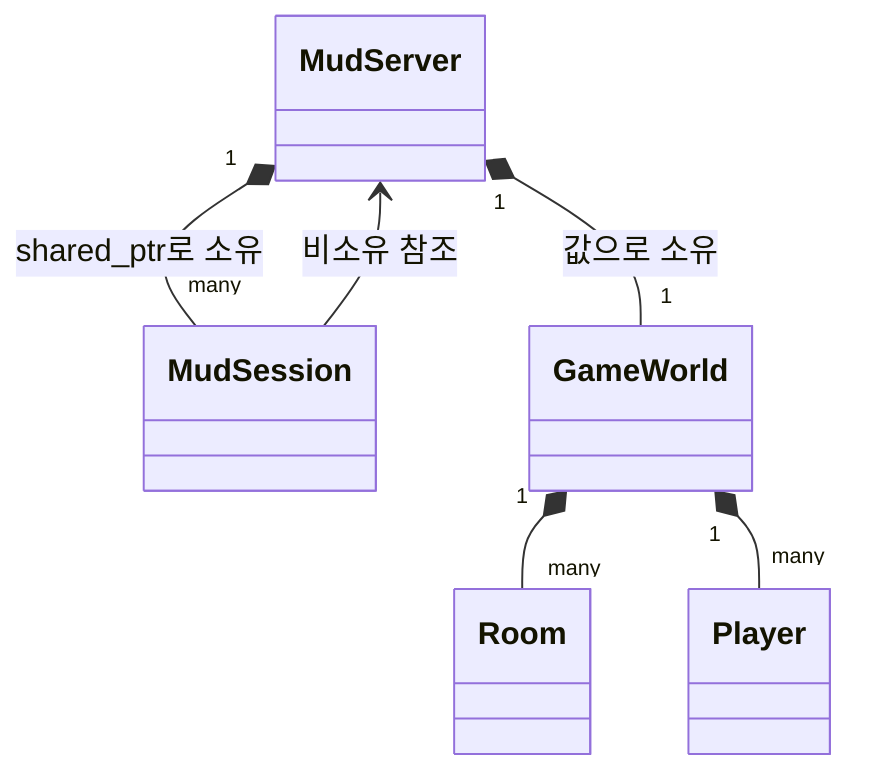
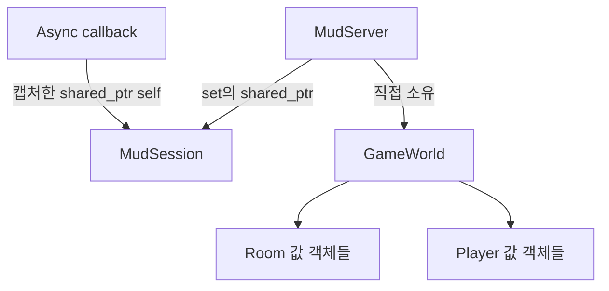
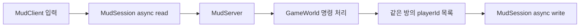

# Boost.Asio Minimal MUD

채팅 예제와 분리된 `MudServer`, `MudClient` C++17 학습용 프로젝트입니다. 목표는 게임 엔진이 아니라 **네트워크 세션이 서버 소유의 플레이어로 연결되는 핵심 흐름**을 보여 주는 것입니다.

## 구성과 실행

`BoostAsioMud.sln`에는 `MudServer`, `MudClient`만 있습니다. Visual Studio 2022에서 `Debug | x64`를 선택하고 솔루션을 빌드합니다. Boost.Asio는 vcpkg 통합을 사용합니다.

MUD 실행 순서:

1. `BoostAsioMud/x64/Debug/MudServer.exe`를 실행합니다.
2. 별도 터미널 두 개에서 `MudClient.exe`를 실행합니다.
3. 각 클라이언트에서 명령을 입력합니다.

Visual Studio에서는 **Solution Properties > Common Properties > Startup Project > Multiple startup projects**에서 서버와 클라이언트를 함께 시작할 수도 있습니다. 두 번째 클라이언트는 별도 실행합니다. MUD 서버 주소는 `127.0.0.1:7777`입니다.

명령은 `look`, `north`, `south`, `east`, `west`, `say <message>`, `help`, `quit`입니다. 클라이언트의 `/quit`도 서버의 `quit`으로 변환됩니다.

## 핵심 클래스

| 클래스 | 책임 |
|---|---|
| `MudServer` | 연결 수락, 세션 소유, 플레이어 ID와 세션 사이의 메시지 전달 |
| `MudSession` | 소켓 하나, 비동기 읽기/쓰기, 안전한 쓰기 큐 소유 |
| `GameWorld` | 방과 플레이어 상태 소유, 명령 처리, 수신자 ID 결정 |
| `Room` | 방 이름, 설명, 출구 |
| `Player` | 플레이어 ID, 표시 이름, 현재 방 ID |



`MudSession`은 네트워크 연결이고 `Player`는 게임 상태입니다. 세션은 `playerId`만 알고, `GameWorld`는 소켓이나 세션을 전혀 모릅니다. 연결 시 `MudServer::join()`이 같은 ID의 플레이어를 만들고, 연결 종료 시 `MudServer::leave()`가 플레이어와 세션을 각각 제거합니다.

## 소유권과 비동기 수명



모든 비동기 세션 콜백은 `self = shared_from_this()`에 해당하는 지역 `shared_ptr`를 캡처합니다. 따라서 시작 함수가 반환된 뒤에도 작업 완료까지 세션이 살아 있습니다. `[this]`만 캡처하면 객체 수명이 늘어나지 않습니다. `std::shared_ptr<MudSession>(this)`는 별도 제어 블록을 만들어 이중 삭제 위험이 있으므로 사용하지 않습니다.

`async_write()`의 `asio::buffer()`는 바이트를 복사하지 않습니다. `MudSession::writeQueue_`가 문자열을 소유하고 완료 콜백 이후에만 `pop_front()`하므로 버퍼가 안전합니다. 동시에 쓰기는 하나만 실행됩니다. 읽기 버퍼는 1 KiB, 세션별 대기 출력은 64 KiB로 제한해 비정상 입력과 느린 클라이언트의 무제한 메모리 증가를 막습니다.

서버는 `io_context.run()`을 한 스레드에서만 실행합니다. 따라서 세션 집합, 게임 월드, 쓰기 큐의 접근이 직렬화되며 이 예제에는 mutex나 strand가 필요하지 않습니다.

클라이언트도 한 줄 입력과 송신 대기열에 상한을 둡니다. 서버가 비정상 종료되면 연결 종료 메시지를 출력합니다. 이 최소 예제는 메인 스레드에서 표준 `std::getline`을 사용하므로, 서버 종료 순간에 이미 콘솔 입력을 기다리는 중이라면 Enter 또는 EOF를 입력해야 프로세스가 끝납니다.

## 명령과 방 단위 방송



`GameWorld`는 전역 방송을 하지 않고 같은 `roomId`를 가진 플레이어 ID만 결과로 반환합니다. `MudServer`가 그 ID에 해당하는 세션을 찾아 전송합니다. `say`는 보낸 사람을 포함한 같은 방 플레이어에게만 보이고, 이동은 이전 방의 퇴장 알림과 새 방의 입장 알림으로 나뉩니다.

세 방은 `Old Gate`, `Broken Hall`, `Torch Room`입니다. Ollama는 아직 사용하지 않습니다. 나중에 `look` 설명이나 NPC 대사를 풍부하게 만들 수 있지만, 방·출구·이동 같은 규칙과 상태는 계속 C++가 소유해야 합니다. 해당 경계는 `GameWorld.cpp`의 TODO에 표시했습니다.

## 빠른 확인

서버를 새로 실행한 상태에서 저장소의 간단한 2클라이언트 스모크 테스트를 실행할 수도 있습니다.

```powershell
powershell.exe -NoProfile -ExecutionPolicy Bypass -File .\test_mud.ps1
```

- 두 클라이언트가 시작 방에서 `say hello`를 입력하면 둘 다 수신합니다.
- 한 클라이언트가 `north`로 이동한 뒤 말하면 시작 방 클라이언트는 수신하지 않습니다.
- 출구가 없는 방향은 `You cannot go that way.`를 반환하고 상태를 바꾸지 않습니다.
- 한 클라이언트가 `quit`해도 서버와 다른 클라이언트는 계속 동작합니다.

핵심 답은 간단합니다. **`MudServer`와 비동기 콜백의 `shared_ptr`가 세션을 살려 두고, `GameWorld`가 플레이어와 방을 소유하며, 세션의 쓰기 큐가 전송 완료까지 버퍼를 살려 둡니다.**
